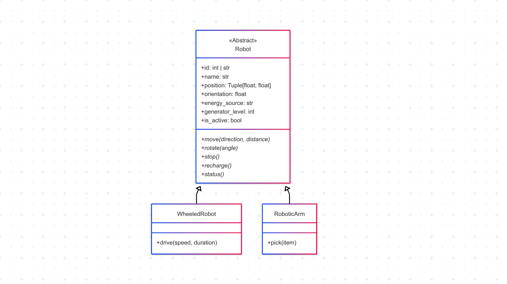

# Robot Simulation Project

This project simulates different types of robots, focusing on a base robot class and two specific types: wheeled robots and robotic arms.

## Project Structure

The core logic for the robots is located in the `Test 1/` directory:

```
Test 1/
├── __init__.py
├── robot.py        # Defines the base Robot class (Abstract Base Class)
├── wheeledRobot.py # Defines the WheeledRobot class
└── roboticArm.py   # Defines the RoboticArm class
```

## Class Descriptions

### `Robot` (in `robot.py`)

This is an abstract base class for all robot types.
- **Attributes:**
    - `id` (int | str): Unique identifier
    - `name` (str): Robot name
    - `position` (Tuple[float, float]): (x, y) coordinates
    - `orientation` (float): Orientation in radians
    - `energy_source` (str): Energy source ("solar", "fossil_fuel", "electric")
    - `generator_level` (int): Power level
    - `is_active` (bool): Active status
- **Key Methods:**
    - `move(direction, distance)`: Abstract method to move the robot
    - `rotate(angle)`: Abstract method to rotate the robot
    - `stop()`: Abstract method to stop the robot
    - `recharge()`: Abstract method to recharge the robot
    - `status()`: Abstract method to get robot status

### `WheeledRobot` (in `wheeledRobot.py`)

Inherits from `Robot`. Represents a robot that moves on wheels.
- **Key Methods:**
    - `drive(speed, duration)`: Drive at a specified speed for a duration
    - Inherits all base methods (move, rotate, stop, recharge, status)

### `RoboticArm` (in `roboticArm.py`)

Inherits from `Robot`. Represents a robotic arm.
- **Key Methods:**
    - `pick(item)`: Pick up an item
    - Inherits all base methods (move, rotate, stop, recharge, status)

## UML Class Diagram

