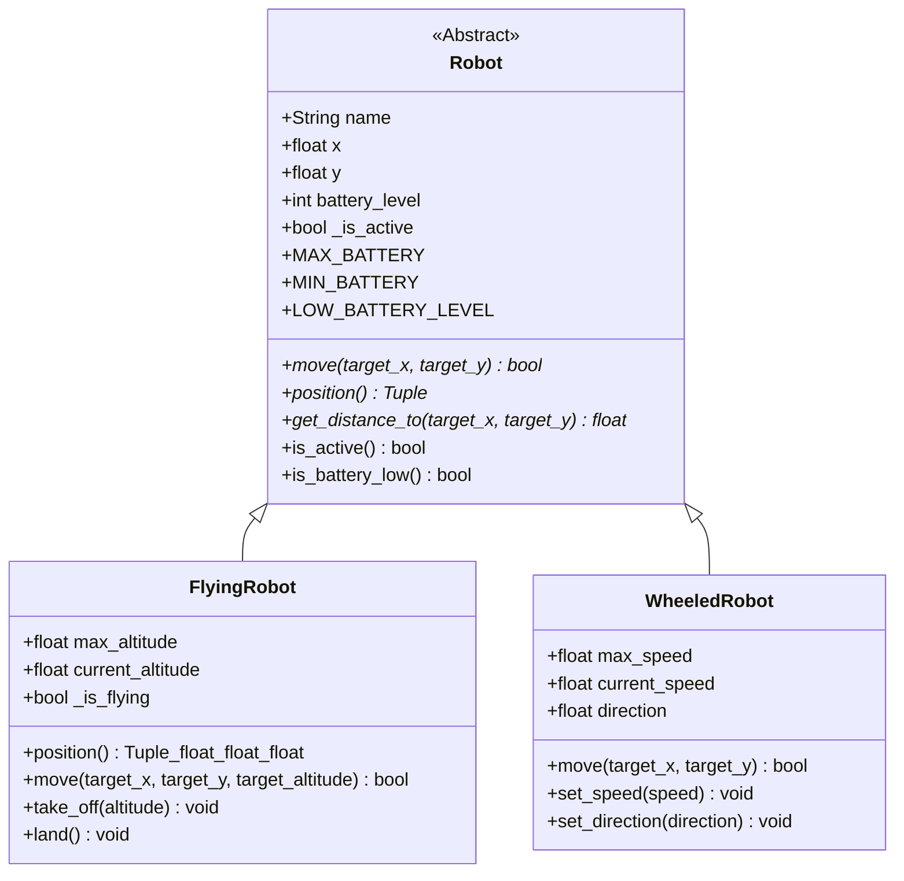

# Robot Simulation Project

This project simulates different types of robots, including a general robot, flying robots, and wheeled robots.

## Project Structure

The core logic for the robots is located in the `test1/` directory:

```
test1/
├── __init__.py
├── flyingrobot.py  # Defines the FlyingRobot class
├── robot.py        # Defines the base Robot class (Abstract Base Class)
└── wheeledrobot.py # Defines the WheeledRobot class
```

## Class Descriptions

### `Robot` (in `robot.py`)

This is an abstract base class for all robot types.
-   **Attributes**: `name` (str), `x` (float), `y` (float), `battery_level` (int), `is_active` (bool).
-   **Key Methods**:
    -   `move(target_x, target_y)`: Abstract method to move the robot.
    -   `position()`: Abstract method to get the current robot position.
    -   `get_distance_to(target_x, target_y)`: Abstract method to compute distance to a target.
    -   `is_active()`: Checks if the robot is active.
    -   `is_battery_low()`: Checks if the battery is low.

### `FlyingRobot` (in `flyingrobot.py`)

Inherits from `Robot`. Represents a robot that can fly.
-   **Additional Attributes**: `max_altitude` (float), `current_altitude` (float), `is_flying` (bool).
-   **Key Methods**:
    -   `take_off(altitude)`: Initiates take-off to a specific altitude.
    -   `land()`: Lands the robot.
    -   `move(target_x, target_y, target_altitude)`: Moves the robot in 3D space.
    -   `position()`: Returns X, Y, and altitude.

### `WheeledRobot` (in `wheeledrobot.py`)

Inherits from `Robot`. Represents a robot that moves on wheels.
-   **Additional Attributes**: `max_speed` (float), `current_speed` (float), `direction` (float, in degrees).
-   **Key Methods**:
    -   `set_speed(speed)`: Sets the robot's speed.
    -   `set_direction(direction)`: Sets the robot's direction.
    -   `move(target_x, target_y)`: Moves the robot to a target X, Y position.

## UML Class Diagram (Mermaid Syntax)


